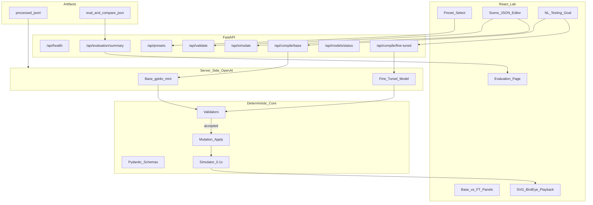

# Architecture

## Components

| Package | Role |
|---------|------|
| `backend/app/schemas` | Strict Pydantic models (road, actors, triggers, mutations, oracles) |
| `backend/app/validators` | Schema/physics/placement/oracle/contradiction checks |
| `backend/app/simulator` | Fixed-timestep 2D kinematics, collisions, TTC, oracles |
| `backend/app/presets` | Eight handwritten demo seeds |
| `backend/app/dataset` | Deterministic SFT example generator |
| `backend/app/eval` | Offline metric harness |
| `backend/app/openai_ft` | Config, jobs, compile, measured evaluation (secrets stay server-side) |
| `frontend` | Dark lab UI + measured evaluation page |

## Trust boundary

- Browser talks only to FastAPI over `/api`.
- OpenAI SDK runs only in Python.
- Canonical training labels always come from deterministic code, never from an LLM.
